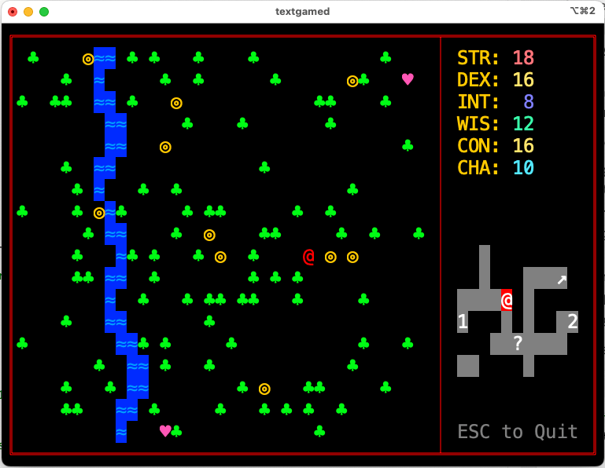

This is a minimal, C++ cross-platform library for writing
real-time games that run in a terminal in text mode.

# Features

- Windows 11 terminal, macOS Tahoe Terminal, macOS iTerm2, Linux xterm
- 24-bit (RBA8) color for foreground and background
- Keyboard input
- Clipping region stack
- Blitting with transparency
- Double buffered (no flicker)
- String printing with word wrap
- Number formatting to string
- Full Unicode support using [char32_t characters](https://en.wikipedia.org/wiki/UTF-32) and strings
- Struct and function C-like API, with C++ strings and destructors for memory management

# Files

`main.cpp`
: Demo program

`textgame.h`
: Cross-platform header and entry point documentation.
  Defines `Vector2i`, `Color3`, `String`, `Character`,
  `Image`, overloaded operators, and helper functions.

`textgame.cpp`
: Cross-platform library implementation

# License

MIT License
